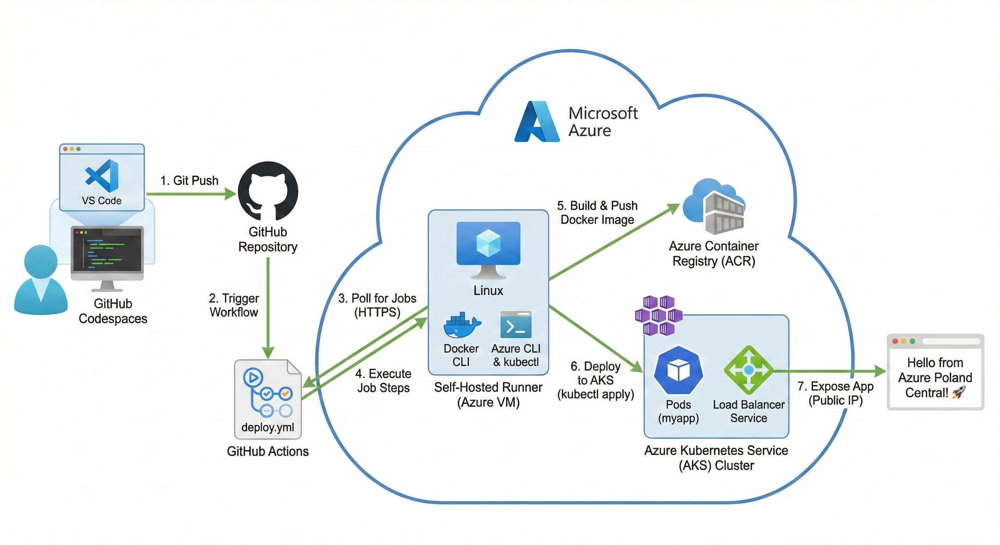

🚀 Azure DevOps Project: End-to-End CI/CD
📖 Overview
This project implements a complete Continuous Deployment (CD) pipeline using GitHub Actions.

Instead of relying on standard GitHub-hosted runners (which are ephemeral and lack access to private networks), this project utilizes a Self-Hosted Runner deployed on a private Azure Virtual Machine. 
This architecture mimics a real-world enterprise environment where security and network control are paramoun

🏗️ Architecture
1. The Diagram

2. The Self-Hosted Runner (The Worker) 🤖We configured a "Listening Bridge" where the Azure VM connects to GitHub to ask for jobs.Host: Azure Virtual Machine (github-runner-vm) running Linux (Ubuntu).Connection Method: Long Polling via outbound HTTPS (Port 443).Role: The runner executes pipeline steps directly inside the Azure Virtual Network.🔐 Security Note: The VM initiates the connection out to GitHub. No inbound firewall ports were opened to the public internet, maintaining high security.Dependencies Installed on Runner:🐳 docker: To build the container image.☁️ az cli: To authenticate with Azure resources.☸️ kubectl: To send deployment commands to the AKS Cluster.⚙️ The Pipeline WorkflowThe automation logic is defined in .github/workflows/deploy.yml.StepCommand / ActionDescriptionTriggeron: push: branches: [ "main" ]The pipeline starts automatically whenever code is pushed to the main branch.Agentruns-on: self-hostedCritical: Tells GitHub to ignore its own cloud servers and send the job specifically to our private Azure VM.Checkoutactions/checkout@v3Downloads the source code from the repository onto the runner (the VM).Loginazure/login@v1Authenticates the runner using the Service Principal (Robot Account).Builddocker build ...Packages the Python application into a Docker Image.Pushdocker push ...Uploads the image to the Azure Container Registry (ACR).Deploykubectl apply -f -Connects to the AKS Cluster, pulls the new image, and updates the application pods.🔐 Authentication & SecretsWe utilize two distinct security bridges to avoid hardcoding passwords.Bridge 1: The "Listener" AuthMechanism: Runner TokenSetup: Generated via ./config.sh on the VM during setup.Purpose: Allows the VM to log in to GitHub and "listen" for queued jobs.Bridge 2: The "Builder" AuthMechanism: Service Principal (SPN)Storage: Saved in GitHub Secrets as AZURE_CREDENTIALS.Purpose: Allows the pipeline script (running on the VM) to authenticate with Azure to manage resources.JSON Structure:JSON{
  "clientId": "<GUID>",
  "clientSecret": "<GUID>",
  "subscriptionId": "<GUID>",
  "tenantId": "<GUID>"
}
🔧 Troubleshooting & Known IssuesCommon errors encountered during the build process and their resolutions.🔴 Error: "Permission denied (publickey)"Cause: SSH Key mismatch between the local machine and the Azure VM.Fix: Reset VM credentials to password-based login using:Bashaz vm user update -u azureuser -p StudentLab@1234 ...
🔴 Error: "Login failed: Content is not a valid JSON object"Cause: Copying the warning text along with the JSON output into GitHub Secrets.Fix: Regenerated Service Principal and carefully copied only the { ... } block.🔴 Error: "command not found: az" or "kubectl"Cause: The Self-Hosted Runner is a "blank slate" Linux server. It does not come with cloud tools pre-installed.Fix: Manually SSH'd into the runner and installed the required tools:Bashcurl -sL https://aka.ms/InstallAzureCLIDeb | sudo bash
sudo az aks install-cli
🔴 Error: "Could not create role assignment"Cause: The Service Principal (Robot) only has Contributor access, not Owner access, so it cannot assign permissions to link ACR and AKS.Fix: Ran the permission link command manually as the human administrator, then removed that step from the pipeline YAML.
